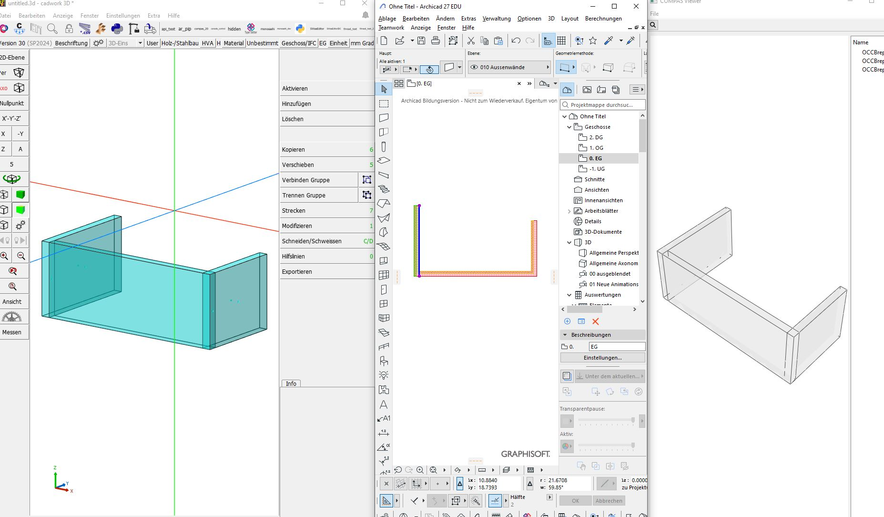
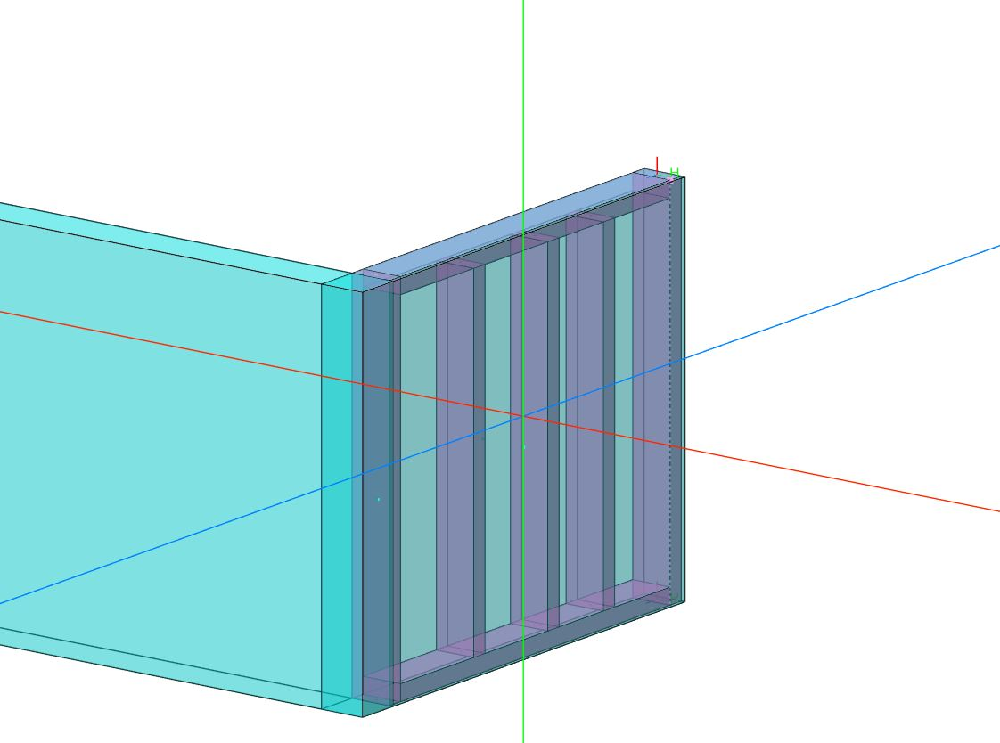
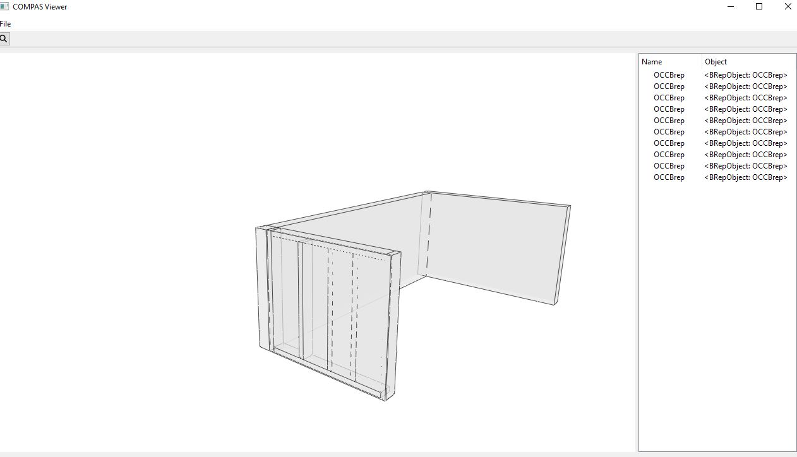

# Getting started

Demo semantic model exchange between ArchiCAD, cadwork.

Wall frames originate from ArchiCAD using the Python API. The rest is illustrated using compas viewer instead, as Python API is limited.
Beams are added to one of the walls in cadwork, and processed as children of the wall element into the semantic model.






## installing the cadwork plugin

1. Create a new virtual environment called `SWaaEditor` in the cadwork plugin directory:
```bash
PLIGIN_DIR=C:\Users\Public\Documents\cadwork\userprofil_30\3d\API.x64\

> cd $PLUGIN_DIR
> virtualenv SWaaEditorIDC
> cd SWaaEditorIDC
```

2. Copy the contents of the `SWaaEditorIDC` directory from this repository, along with the `requirements.txt` file to the newly created plugin folder.

3. Activate new virtual environment and install COMPAS dependencies:
```bash
> Scripts\activate
> (SWaaEditorIDC) pip install -r requirements.txt
```

4. Open cadwork, a new user plugin called SWaaEditorIDC should appear.